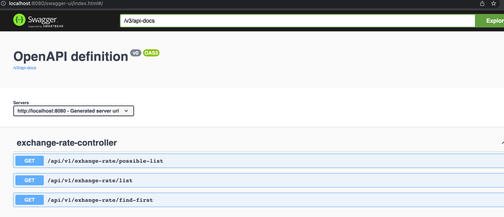

# Potential Gain

### swagger ui

* [swagger](http://localhost:8080/swagger-ui/index.html)



### get-all-possible
We can earn the same gain by buying and selling on different days.
That's why we'll use it to list all possible wins. This will be return a list.

### find-max
the one with the maximum gain returns. (there may be more than one with the same earnings).

# response explanation

```json
{
  "buyRate": {
    "day": 11,
    "buyExchangeRate": 132,
    "sellExchangeRate": 136  // using this rate to buy foreign amount day 11
  },
  "sellRate": {
    "day": 13,
    "buyExchangeRate": 142,  // using this rate to exchange from foreign amount to local amount day 13
    "sellExchangeRate": 144
  },
  "gain": 44.11764705882378
}
```
In the above result, if we buy on the <b>11th</b> day and sell on the <b>13th</b> day, we will gain <b>44.11764705882378</b>.

### There is more than one path with the same highest rate.
```json
[
  {
    "buyRate": {
      "day": 2,
      "buyExchangeRate": 132,
      "sellExchangeRate": 136
    },
    "sellRate": {
      "day": 13,
      "buyExchangeRate": 142,
      "sellExchangeRate": 144
    },
    "gain": 44.11764705882378
  },
  {
    "buyRate": {
      "day": 5,
      "buyExchangeRate": 132,
      "sellExchangeRate": 136
    },
    "sellRate": {
      "day": 13,
      "buyExchangeRate": 142,
      "sellExchangeRate": 144
    },
    "gain": 44.11764705882378
  },
  {
    "buyRate": {
      "day": 8,
      "buyExchangeRate": 132,
      "sellExchangeRate": 136
    },
    "sellRate": {
      "day": 13,
      "buyExchangeRate": 142,
      "sellExchangeRate": 144
    },
    "gain": 44.11764705882378
  },
  {
    "buyRate": {
      "day": 11,
      "buyExchangeRate": 132,
      "sellExchangeRate": 136
    },
    "sellRate": {
      "day": 13,
      "buyExchangeRate": 142,
      "sellExchangeRate": 144
    },
    "gain": 44.11764705882378
  }
]
```
In the above result, if we buy on the 2, 5, 8, 11  days and sell on the 13th day, we will gain 44.11764705882378.


